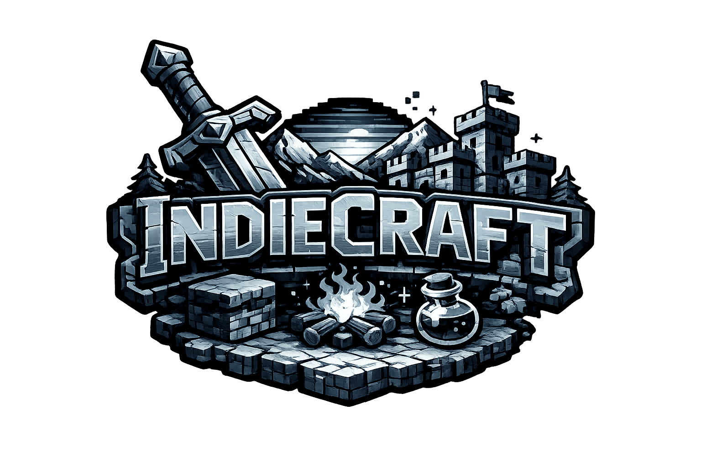

# IndieCraft

  

  <strong>Project management that actually makes sense.</strong>

Most tools treat tasks like a grocery list. IndieCraft treats them like what they are: steps toward something bigger.

---

## The Problem

You've tried the enterprise tools. Jira, Monday, Asana, ClickUp - they all promise "agile workflows" and "cross-functional visibility" while burying you in dashboards, story points, and ceremonies that slow you down more than they help.

You're a small team. You don't need a system designed for 500-person orgs with dedicated project managers. You need to know what you're building, what's blocking you, and what's next.

## The Solution

IndieCraft is built around one core idea: **Goals drive tasks, not the other way around.**

Every task exists because it pushes a goal forward. Every goal exists because it ships something real. This isn't a philosophy - it's just how productive teams actually work.

### Goals First

Start with what you're trying to accomplish. A milestone. A feature. A deliverable. Give it a target date. That's your goal.

### Tasks Serve Goals

Break it down. What needs to happen to get there? Art assets, code features, audio, documentation - each task links to the goal it serves. Nothing floats in limbo.

### The Feedback Loop

As tasks complete, goals progress. You see momentum. Your team sees momentum. When a goal ships, you archive it and move on. No burndown charts. No velocity metrics. Just work getting done.

### Sprints Emerge Naturally

You don't need to force work into two-week boxes. When you organize around goals, sprints happen organically - clusters of tasks that ship together because they *belong* together. This is how real pipelines work, from two-person indies to AAA studios that forgot why they started using the frameworks they use.

---

## What You Actually Get

- **Goals & Roadmapping** - The big picture, with target dates and progress tracking
- **Task Management** - Organized by what matters: Art, Code, Audio, Design, Docs, Marketing
- **Schedule & Calendar** - Milestones and deliverables on a timeline you can export
- **Request Systems** - Let your team suggest assets and features without derailing focus
- **Bulletin Board** - Quick notes, announcements, reminders - no meeting required
- **Real-Time Sync** - Everyone sees the same state, always
- **Task Dependencies** - Know what's blocked and why

---

## Self-Hosted, Self-Owned

Your data lives in your own Supabase instance. No monthly fees. No per-seat pricing. No vendor holding your project hostage.

Set up takes five minutes. The app walks you through it.

---

## Get Started

1. Download the latest release
2. Launch and follow the setup wizard
3. Create your first goal
4. Ship something

---

## Changelog

### v0.2.0
- **Config Export/Import** - Share your Supabase connection as a `.json` file so teammates can skip manual setup
- **Settings Modal** - New gear icon in the sidebar to view connection info and export config
- **Login Screen Reconfiguration** - Import a config file or re-run the setup wizard directly from the login page
- **Setup Wizard Import Flow** - Importing a config auto-validates the connection and skips the schema step

### v0.1.0
- Initial release
- Goal-driven task management with four-stage workflow
- Schedule with calendar and list views
- Modeling and feature request systems
- Bulletin board, notifications, and real-time sync
- Library with 3D model preview and audio player
- Self-hosted via Supabase (BYOD)

---

**Built by [Scythe Dev Team](https://scythedevteam.com)** - the studio behind Happy's Humble Burger Farm.
